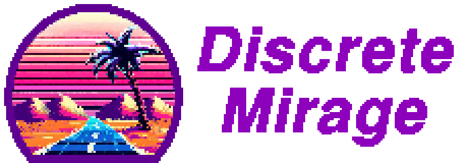
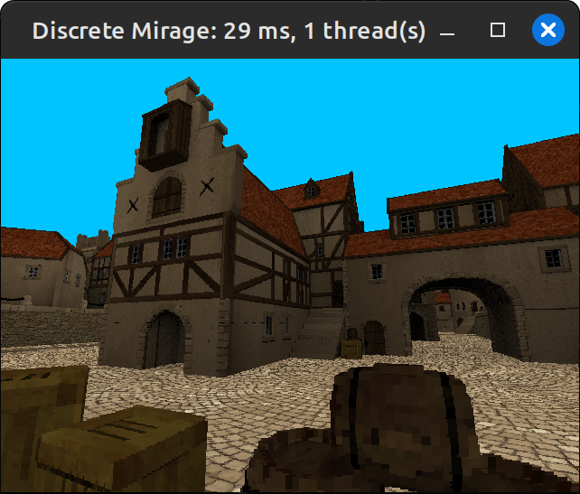

# discrete-mirage

A C library for rendering voxel models on CPU.

Currently, it's more of a prototype / proof-of-concept, so use at your own risk. If you do, no attribution is necessary, but a mention would nevertheless be appreciated :-)

The demo folder contains a [C++ example](demo/src/main.cpp) of using the library to render a small test scene. Once you manage to build the project, run the demo with a command line argument specifying a path to the octree file (a couple of such files can be downloaded from [here](https://github.com/dairin0d/OctreeSplatting/releases)).

If you're curious about the details, take a look at the [notes](docs/notes.md).

Example screenshot from the demo (using a voxelized version of ["medieval kind of seaport" by tokabilitor](https://www.blendswap.com/blends/view/50534)):

